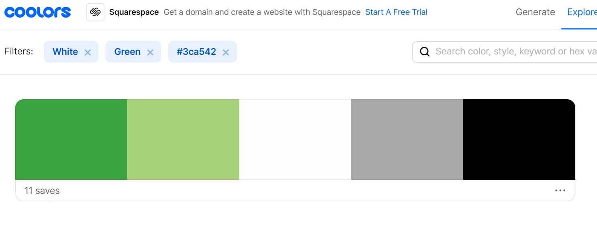

# Contents 

# Ex Planta 

The live site can be viewed [here]

# UX
## Strategy
### Project Goals 
The goal of this project is to build a full-stack site that allows users to manage a common dataset using CRUD functionality. 

Ex Planta is a speciality vegan recipe website. The websites aim is to encourage users to upload, save and edit recipes to build a destination for people who live by vegan or plant-based values. The secondary aim is create a revenue stream by promoting a vegan cookbook linking to an external sales site. 

### User Stories 
First time user goals: 
- As a first time user, i want to understand the purpose of the website easily from the homepage
- As a first time user, i want to see enticing recipes that inspire me to recreate them
- As a first time user, i want to establish the benefits of registering and creating an account 
- As a first time user, i want to be able to register and login quickly and eaisly using simple but safe forms

Returning user goals:
- As a returning user, i want to easily log in to my account 
- As a returning user, i want to be able to veiw full recipes including the ingredients list and method
- As a returning user, i want to be able to search recipes by name
- As a returning user, i want to be able to save recipes i like to easily locate at a later date 
- As a returning user, i want to be able to upload recipes to the site for others to create 
- As a returning user, i want to be able to edit & delete recipes i have previously added

Admin user goals:
- As an admin user, i need to be able to edit or delete any recipe which i feel arent suitable for the website 

# Structure
## Features
Features differ for two different types of users, as a new user without an account i can:
- Veiw the homepage 
- view the recipe page
- view recipe cards but not the detail including ingredients and method, this is to encourage users to sign up to the site 
- view the login page
- view the register page

As a logged in account user, i can view all that a new user can as well as: 
- view a log out page 
- view a user profile page 
- view a full recipe including method and ingredients using the recipe card button 
- Full use of CRUD functionality;
    - Create a recipe using the add recipe page 
    - Read a full recipe card including all the details 
    - Delete one of my recipes on the profile page
    - Edit one of my recipes on the profile page  

### Home Page
- The homepage features a carousel of recipes, created by admin only to ensure it only features appropriate and complete recipes for site user. A button is also featured on the carousel which directs to the recipe page. 
- An "About us section" along with a call to action button linking to an external page where a user can buy the cook book. This supports the secondary project goal. 
- A "whats new" feature, a small snippet of recipes the user can expect to see with a button to direct to the main recipe page. 

### Login & Register pages 
- The login and register pages follow the same design and format to align the pages. 
- The login page features a link below the login button to direct users to the register page should they find themselves on the wrong section, vice versa on the register page. 
- The register page features a "passoword" and "confirm password" feild, this is to ensure the user doesnt enter an incorrect password and lock themselves out of their account in future. 

### Recipe Page
- The recipe page features a search and find function at the top of the page. 
    - There is a search bar allowing users to search the page for recipes by recipe name
    - alongside the search bar there is a dropdown options list for the user to search recipes by category, "breakfast, lunch or dinner"
- The recipe page then features all the recipe cards listed, the recipe cards contain some key details like an image of the recipe, the recipe name, how many it serves, the time it takes to cook and a difficulty level. There is then a button on each card which directs to a full recipe page, with further details including, method, ingredients, prep time, cuisine type and a gluten free indicator. 
- The recipe cards will act the same as the cards on the home page, a registered logged in user will be able to view the full card, however, a non registered user will be encouraged to log in before being able to view the full recipe. 

### Add Recipe Page
- A logged in user will see an add recipe page, this page allows a user to add a recipe to the database to be viewed on the site. On this page there are all the fields needed to complete a full recipe card. This page contains a number of features:
    - A drop down to select the recipe category
    - A switch to signal if the recipe is gluten free or not
    - Both the method and ingredient files are listed as an array and each ingredient/method can be added or removed using the interactive add/remove buttons
    - An add image link

### Profile edit & delete recipe
- The profile page is available to a logged in user, they are first met with a small table showing the username and the number of uploaded recipes. 
- Underneath this there is then an option for the user to delete their profile should they need to, on clicking this there is added security of a pop up modal to confirm the user wishes to continue with this action
- The recipes the user has uploaded are then listed below, on the recipe cards there are two extra buttons "delete recipe" and "edit recipe". 
- On the user pressing delete recipe, similar to the delete profile a pop up modal appears to confirm the users actionsm should they go ahead the recipe is then deleted from the database
- The second button is to edit a recipe the user has uploaded. On clicking this the user is directed to a new edit recipe page, this is set up similar to the "add recipe" page, however the recipe details of that being edited are auto completed in the fields for ease of use. Once a recipe is edited the databse is updated with the new details. 

### Future features
The main areas i wish to improve on in the future are:
- Further page options for the recipes page, adding too many recipes to one page could look crowed so an improvement would be to have the recipes displayed ona number of pages using next and back buttons. 
- Currently users are uploading images using URL's i would like to use s3 bucket as When you upload a file to Amazon S3, it is stored as an S3 object. Objects consist of the file data and metadata that describes the object. This will prevent images becoming void should the original owners remove them.

# Design 

# Skeleton
## Wireframes
My wireframes were created using [Balsamiq](https://balsamiq.com) wireframes and are detailed below:
- Mobile 
- Tablet
- [Desktop](https://olivergray03.github.io/MS3/wireframes/ExPlantaDesktopwireframes.pdf)

## Design
- I chose to go with a neutral mixed with predominantly green colour scheme as i felt this matched the "Vegan" philosophy of my target audience. The color scheme was inspired by [Coolers](https://coolors.co/palettes/trending/white,green,#3ca542) and is shown below:

### Typography
- The typography used accross the site came from [Google Fonts](https://fonts.google.com/) and was called Noto Sans. 

# Technology Used
Languages
- [HTML](https://en.wikipedia.org/wiki/HTML)
- [CSS](https://en.wikipedia.org/wiki/CSS)
- [JavaScript](https://en.wikipedia.org/wiki/JavaScript)
- [Python](https://en.wikipedia.org/wiki/Python_(programming_language))

Libraries & Integrations
- [Flask](https://en.wikipedia.org/wiki/Flask_(web_framework))
- [Jinja](https://en.wikipedia.org/wiki/Jinja_(template_engine))
- [Materialize](https://materializecss.com/cards.html)
- [Font Awesome](https://fontawesome.com/)
- [Google Fonts](https://fonts.google.com/)
- [JQuery](https://jquery.com/)

Database
- [MongoDB](https://www.mongodb.com/)

Version control
- [Git](https://git-scm.com/) 
- [Git Hub](https://github.com/)

Wireframes 
- [Balsamiq](https://balsamiq.com)

Other
- [Heroku](https://id.heroku.com/login)
- [Google Dev Tools](https://developers.google.com/web/tools/)
- [Responsinator](https://www.responsinator.com/)
- [Chrome lighthouse](https://developers.google.com/web/tools/lighthouse)
- [W3C Jigsaw](https://jigsaw.w3.org/css-validator/)
- [Favicon](https://favicon.io/)

# Testing
## Testing User Stories
- As a first time user, i want to understand the purpose of the website easily from the homepage
    - The user is met with a large carousel of recipe images with an interactive "view recipe button" indicating the purpose of the site.
    - Below this there is an "about us" section further outlining the purpose of the site. 
- As a first time user, i want to see enticing recipes that inspire me to recreate them
    - To further entice the user there is a small sample of recipe cards at the bottom of the home page, there is then an "explore" button which directs to the main recipe page 
    - The main recipe page displays all the recipes listed on the site for the user to get key information from. 
- As a first time user, i want to establish the benefits of registering and creating an account 
    - When clicking the "full recipe" button the user is directed to the register page as well as being displayed a flash message encouraging the user to regsiter for an account to see the full recipe. 
- As a first time user, i want to be able to register and login quickly and eaisly using simple but safe forms
    - Both the regsiter and login pages follow the same style and design for brand and user consistancy. 
    - Both forms only require the necessary fields to be complete to enter the site. Whilst being simple to complete the pages also offer security and peace of mind for the user by validating fields, matching password entries and a link to either the register or login page should they be on the wrong page. 

- As a returning user, i want to easily log in to my account 
    - Similar to the above the login page is simple to use with only two fields and a prompt message should either the username or password be incorrect. 
- As a returning user, i want to be able to veiw full recipes including the ingredients list and method
    - As a loged in user you can use the "full recipe" button on the recipe cards to view the full recipe and details which were hidden on the smaller recipe sample card. 
- As a returning user, i want to be able to search recipes by name
    - All users have access to a search bar located at the top of the recipe page, here you can search recipe by name or use the dropdown category search to search by meal type. 
- As a returning user, i want to be able to save recipes i like to easily locate at a later date
    - Logged in users see a heart icon on the side of each card, a recognised icon for save or add to favourites. When pressing this icon the recipe is saved and listed to view on the users profile page. 

- CRUD Functionality
    - Logged in users have access to CRUD functionality for recipes accross the site 
    - Users can create a recipe using the "add recipe" page. This page is a simple form with either drop down options or text fields for users to enter all the details they would see on the recipe card. 
    - The ingredient and method fields are added as array's, once a user has entered on part of they can use the "add ingredient/step" buttons to add further elements. These buttons are interactive and a "remove ingredient/step" button appears once one element has been added. 
    - Reading a recipe has been detailed in the recipe card samples or the full recipe available to logged in users only. 
    - A user can only edit or delete a recipe they have created (unless they have admin restrictions)
    - Editing a recipe is done using the same form used to create a recipe. First the user must locate the recipe in their profile and click the "edit recipe" button, they are then redirected to the form with all the elements from the recipe filled in. The user can then edit these and update the database. 
    - To delete a recipe the user must locate the recipe in their profile and click the "delete recipe" button, this removes the recipe from the database. #
- As an admin user, i need to be able to edit or delete any recipe which i feel arent suitable for the website 
    - An admin user can do all of the above to any recipe accross the site. 

## Testing Performance

## Testing Functionality

## Further Testing

# Code Validation

# Deployment
## GitHub Pages

This project was deployed to Github pages using the following steps:

1. Log into Github 
2. Select the OliverGray03/ms3 respository
3. Click the settings tab at the top of the repository
4. Scroll to the "GitHub Pages" section of the page
5. Under "Source", click the dropdown called "None" and select "Master Branch"
6. The page will automatically refresh
7. The project has now been deployed. Scroll back to the GitHub pages section and click on the link above the source heading to view the live site.

## Forking the GitHub repository

By forking the GitHub Repository we make a copy of the original repository on our GitHub account to view and/or make changes without affecting the original repository by using the following steps:

1. Log into Github 
2. Select the OliverGray03/ms3 respository.
3. At the top of the Repository (not top of page) just above the "Settings" Button on the menu, locate the "Fork" Button
4. You should now have a copy of the original repository in your GitHub account

## Making a clone to run locally

1. Log into GitHub
2. Select the OliverGray03/ms3  respository
3. Under the repository name, click "Clone or download"
4. To clone the repository using HTTPS, under "Clone with HTTPS", copy the link
5. Open Git Bash
6. Change the current working directory to the location where you want the cloned directory to be made
7. Type "git clone", and then paste the URL you copied in Step 3

## Heroku App

- Log in or sign up to Heroku.
- From the Heroku Dashboard click "Create New App" button.
- Give the app a name (this must be unique and Heroku will let you know if this available)
- Set the most appropriate region and click "Create App", which will take the user to the "App Dashboard".
- Within our project, to install Heroku type: "npm install -g heroku" in the terminal. We then need to tell Heroku which applications and dependencies are required to run the app.
- Enter the following into the terminal: "pip3 freeze --local > requirements.txt". The Procfile is what Heroku looks for to know which file runs the app and how to run it.
- Enter the following into the terminal: "echo web: python app.py > Procfile".
- Set up automatic deployment by clicking the deploy tab and clicking GitHub as the deployment method.
- Ensure your GitHub profile is displayed, then add the name of the repository and click search.
- Click "Connect" to the correct repository.
- Click the "Settings" tab and then click "Reveal Config Vars".
- Here we can securely tell Heroku which variables are required. These can be found in the "env.py" file and are as follows:
    - IP : 0.0.0.0
    - Port : 5000
    - SECRET_KEY : Randomly Generated from [RandomKeygen](https://randomkeygen.com/)
    - MONGO_URI : Unique MongoDB URI
    - MONGO_DBNAME : Unique MongoDB Database Name
- To get the MONGO_URI, on MongoDB click the "Overview" tab followed by the "Connect" button.
- Select "Connect Your Application"
- Ensure "Python" is selected for the "Driver" and choose the appropriate version.
- Copy the connection string and substitute in your own database name and password in the angle brackets placeholder.
- Click the "Deploy" tab and "Enable Automatic Deployment"

# Credits
- My mentor Antonio Rodriguez who has provided me with guidance and support through the project
## Code
- Code Institutes task manager app walkthrough project for the basis behind CRUD functionality
- [Stack overflow](https://stackoverflow.com/) for a number of CSS styling and python code queries 
## Media
- The image used for both the register and login page was sourced from [Vanesa Conunaese on Unsplash](https://unsplash.com/photos/JXow53j6AtE)
- The image used on the hompage was sourced from [Ella Olsson on Unsplash](https://unsplash.com/photos/2IxTgsgFi-s)
- The image used for book advertisement was sourced from [The Vegan Larder](https://theveganlarder.com/one-pound-vegan-meals-cook-book-review/)

